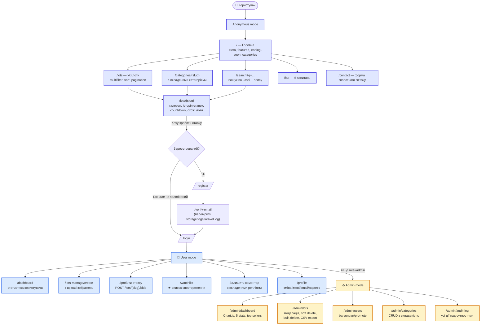
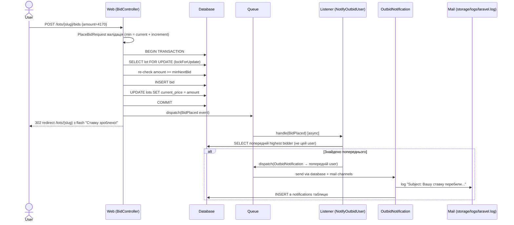
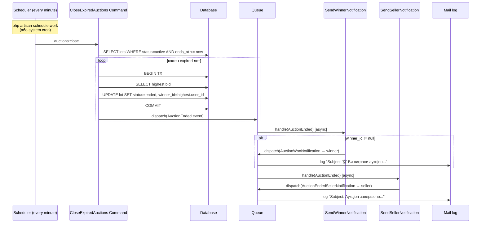
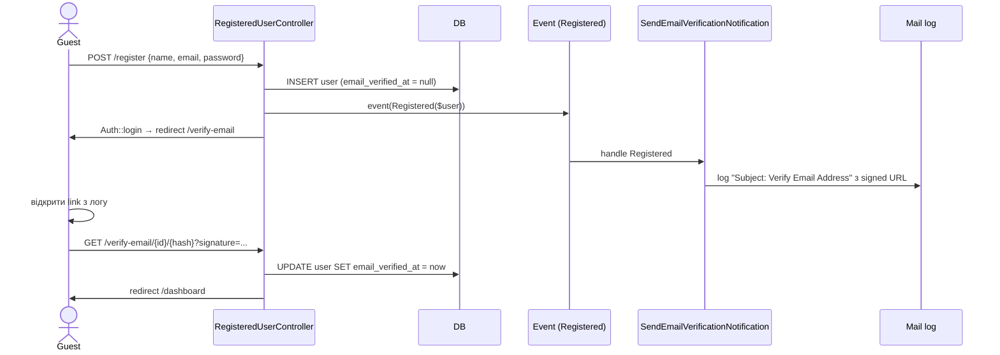
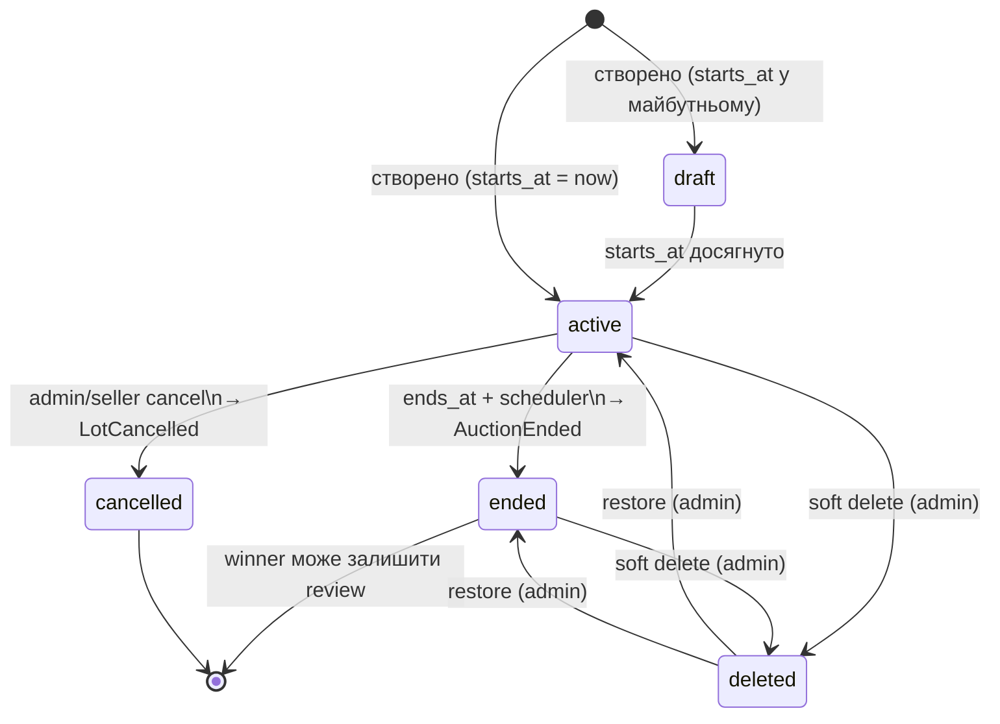

# User Flow Map — AuctioHub

Карта переходів користувача через систему: 3 режими (anonymous / registered / admin) + критичні flows (bid placement, auction lifecycle, mail notifications).

## 🗺 Загальна навігаційна карта



## 1. 👤 Anonymous mode (без логіну)

**Що користувач БАЧИТЬ і МОЖЕ робити:**

| Дія | Маршрут | Контролер |
|---|---|---|
| Головна з hero + featured + ending soon | `GET /` | `HomeController@index` |
| Список усіх лотів з фільтрами | `GET /lots` | `LotController@index` |
| Деталі лоту: галерея, історія ставок, коментарі, схожі | `GET /lots/{slug}` | `LotController@show` |
| Категорії з вкладеністю (breadcrumbs) | `GET /categories/{slug}` | `CategoryController@show` |
| Пошук за назвою/описом активних лотів | `GET /search?q=...` | `SearchController@index` |
| Часті запитання | `GET /faq` | `FaqController@index` |
| Форма контактів (рендер) | `GET /contact` | `ContactController@show` |
| Надіслати контакт-форму | `POST /contact` | `ContactController@send` |
| Реєстрація | `GET/POST /register` | `Auth\RegisteredUserController` |
| Логін | `GET/POST /login` | `Auth\AuthenticatedSessionController` |
| Forgot password | `GET/POST /forgot-password` | `Auth\PasswordResetLinkController` |

**Що користувач НЕ може:**
- ❌ Зробити ставку → редирект на `/login`
- ❌ Додати в watchlist → редирект на `/login`
- ❌ Залишити коментар → редирект на `/login`
- ❌ Створити лот → редирект на `/login`
- ❌ Зайти в admin → редирект на `/login`

**UI signals для anonymous:**
- На сторінці лоту замість форми ставки — посилання "Увійдіть, щоб зробити ставку"
- У навбарі — кнопки "Увійти" / "Реєстрація"
- У футері — посилання "Увійти", "Реєстрація", "Забули пароль?"

## 2. 👤 Authenticated User mode (role=user)

**Передумова**: зареєстрований + email верифікований (middleware `auth` + `verified`).

**Все що міг анонім + додатково:**

| Дія | Маршрут | Метод | Policy/Validation |
|---|---|---|---|
| Свій кабінет | `GET /dashboard` | — | auth+verified |
| Створити лот (з upload зображень) | `GET /lots-manage/create` + `POST /lots-manage` | StoreLotRequest | Не banned + ≤6 images max 5MB |
| Редагувати свій лот | `GET /lots-manage/{slug}/edit` + `PUT /lots-manage/{slug}` | StoreLotRequest | `LotPolicy@update` — тільки seller, без ставок, status draft/active |
| Видалити свій лот | `DELETE /lots-manage/{slug}` | — | `LotPolicy@delete` — seller або admin, без ставок |
| Зробити ставку на чужий лот | `POST /lots/{slug}/bids` | PlaceBidRequest | `BidPolicy@create` — не свій лот, не banned, active, в межах часу. **DB transaction + lockForUpdate** |
| Додати/прибрати з watchlist | `POST /watchlist/{slug}/toggle` | — | — |
| Дивитись свій watchlist | `GET /watchlist` | — | — |
| Коментар на лот | `POST /lots/{slug}/comments` | StoreCommentRequest | — |
| Відповідь на коментар | `POST /lots/{slug}/comments` (з `parent_id`) | — | — |
| Видалити свій коментар | `DELETE /comments/{id}` | — | `CommentPolicy@delete` — автор або admin |
| Оцінити лот після виграшу | `POST /lots/{slug}/reviews` | StoreReviewRequest | `ReviewPolicy@create` — тільки winner після ended |
| Профіль (зміна імені/email) | `PATCH /profile` | — | auth |
| Видалити свій акаунт | `DELETE /profile` | — | auth + password confirm |
| Logout | `POST /logout` | — | — |

**UI signals для user:**
- Навбар: "+ Лот" / "★ Список" / ім'я + "Вийти"
- На лоті: видима форма ставки з runtime min validation (`amount >= current + increment`)
- Видима форма коментарів

## 3. ⚙ Admin mode (role=admin)

**Передумова**: middleware `auth` + `verified` + `admin` (EnsureAdmin перевіряє `role === 'admin'`).

**Все що міг user + додатково:**

| Дія | Маршрут | Метод |
|---|---|---|
| Dashboard з Chart.js + stats | `GET /admin/dashboard` | — |
| Список усіх лотів (з трешем) | `GET /admin/lots[?trashed=1&status=&q=]` | — |
| Скасувати лот (cancel) | `POST /admin/lots/{slug}/cancel` | — |
| Soft delete лоту | `DELETE /admin/lots/{slug}` | — |
| Restore з Trash | `POST /admin/lots/{id}/restore` | — |
| Bulk delete (декілька разом) | `POST /admin/lots/bulk-delete` з `ids[]` | — |
| Експорт CSV | `GET /admin/lots/export` | text/csv |
| Список користувачів | `GET /admin/users` | — |
| Заблокувати (banned_at) | `POST /admin/users/{id}/ban` | EnsureNotBanned автоматично виключає при login |
| Розблокувати | `POST /admin/users/{id}/unban` | — |
| Підвищити до admin | `POST /admin/users/{id}/promote` | — |
| Список категорій | `GET /admin/categories` | — |
| Створити категорію (з parent) | `POST /admin/categories` | — |
| Видалити категорію | `DELETE /admin/categories/{id}` | блокується якщо є лоти/підкатегорії |
| Audit log (усі дії над Lot/Category/User) | `GET /admin/audit-log` | через AuditObserver |

**UI signals для admin:**
- Навбар: додатково "⚙ Адмін" (амбер-жовтий)
- Окремий темний admin-layout з Chart.js CDN

## 4. 🎯 Критичні sequence flows

### 4.1 Bid placement з outbid notification



### 4.2 Auction expiration → winner notification



### 4.3 Реєстрація + email verification



## 5. 🔐 Permissions Matrix

| Дія | Anonymous | User (own) | User (other's) | Admin |
|---|:---:|:---:|:---:|:---:|
| Дивитись лоти | ✅ | ✅ | ✅ | ✅ |
| Зробити ставку | ❌ login | — (свій лот заборонено) | ✅ (якщо не banned) | ✅ |
| Створити лот | ❌ | ✅ | — | ✅ |
| Редагувати лот | ❌ | ✅ (без ставок) | ❌ | ✅ |
| Видалити лот | ❌ | ✅ (без ставок) | ❌ | ✅ (soft delete) |
| Скасувати лот | ❌ | ✅ (seller) | ❌ | ✅ |
| Коментар написати | ❌ | ✅ | ✅ | ✅ |
| Коментар редагувати | ❌ | ✅ (свій) | ❌ | — |
| Коментар видалити | ❌ | ✅ (свій) | ❌ | ✅ |
| Watchlist toggle | ❌ | ✅ | ✅ | ✅ |
| Залишити review | ❌ | — | ✅ (тільки winner) | ❌ (не учасник) |
| Bulk delete лотів | ❌ | ❌ | ❌ | ✅ |
| Restore from Trash | ❌ | ❌ | ❌ | ✅ |
| Ban user | ❌ | ❌ | ❌ | ✅ (не іншого admin) |
| Promote to admin | ❌ | ❌ | ❌ | ✅ |
| Категорії CRUD | ❌ | ❌ | ❌ | ✅ |
| Audit log | ❌ | ❌ | ❌ | ✅ |
| CSV export | ❌ | ❌ | ❌ | ✅ |
| Sanctum API (login/lots) | ✅ public endpoints | ✅ + token | ✅ | ✅ |
| Sanctum API (bid/watchlist) | ❌ 401 | ✅ token + policy | — | ✅ |

## 6. 🚥 State machine лоту



## 7. 🌍 Локалізація (UK/EN)

```mermaid
flowchart LR
    Request[HTTP Request] --> Middleware[SetLocale middleware]
    Middleware --> CheckQuery{?lang=uk/en\nу URL?}
    CheckQuery -->|Так| SetCookie[Зберегти cookie 'locale']
    CheckQuery -->|Ні| CheckCookie{Cookie 'locale'\nіснує?}
    SetCookie --> Apply[app->setLocale]
    CheckCookie -->|Так| Apply
    CheckCookie -->|Ні| DefaultLocale[APP_LOCALE з .env\n=uk]
    DefaultLocale --> Apply
    Apply --> Response[Render з lang/{uk,en}/messages.php]
```

⚠️ Реальна локалізація templates — частково. Інфраструктура + switcher працюють, повний переклад Blade-strings — TODO.

## 8. 🔗 Cross-refs

- [docs/routes.md](routes.md) — повна таблиця 50+ маршрутів
- [docs/features-checklist.md](features-checklist.md) — mapping на coursework/feature-catalog.md
- [database/er-diagram.md](../database/er-diagram.md) — ER діаграма доменних сутностей
- [STUDENT_QUICKSTART.md](../STUDENT_QUICKSTART.md) — як запустити локально
- [docs/screenshots/](screenshots/) — візуальні скріни ключових екранів
- [docs/screenshots/e2e/](screenshots/e2e/) — повний QA звіт з 19 тестами

## 9. 🎓 Як використати цю карту для своєї курсової

1. **Скопіюй структуру flows** — anonymous → register → user → admin це універсальна схема для будь-якої системи (e-shop, booking, catalog).
2. **Адаптуй permissions matrix** — для своєї теми перепиши таблицю «хто що може» (наприклад, для Booking: user → бронює, seller → керує своїм календарем).
3. **State machine** — кожна доменна сутність має life-cycle (Order: pending→paid→shipped→done; Appointment: requested→confirmed→completed→reviewed).
4. **Sequence diagrams для критичних flows** — Bid+Outbid тут заміняй на: Order+Notification, Booking+Reminder тощо.
5. **У ПЗ курсової** — діаграми flowchart/sequence/state з Mermaid можна вставити як PNG/SVG (експорт через [mermaid.live](https://mermaid.live)).
